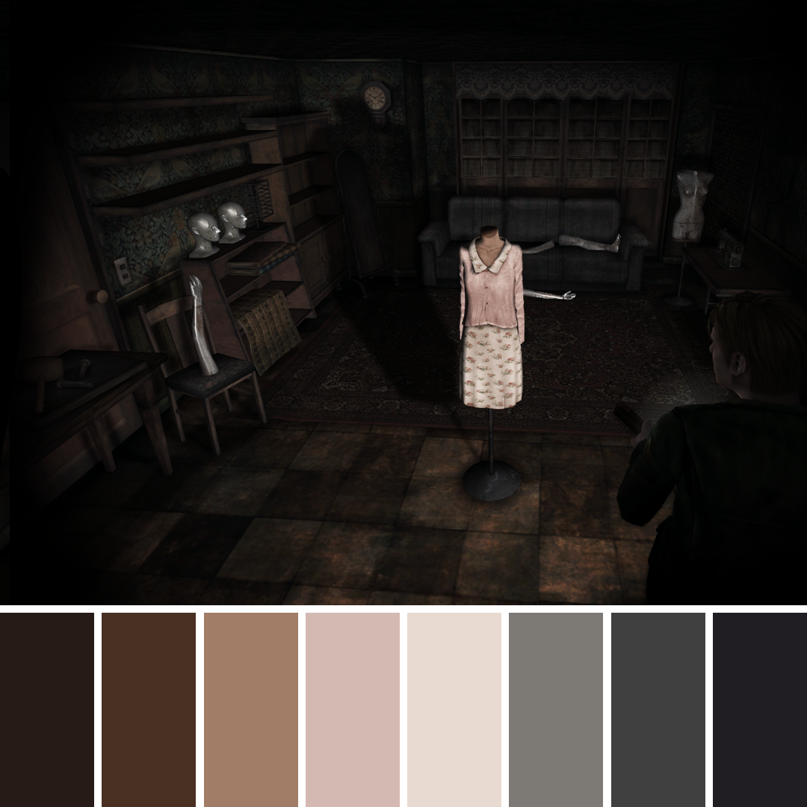
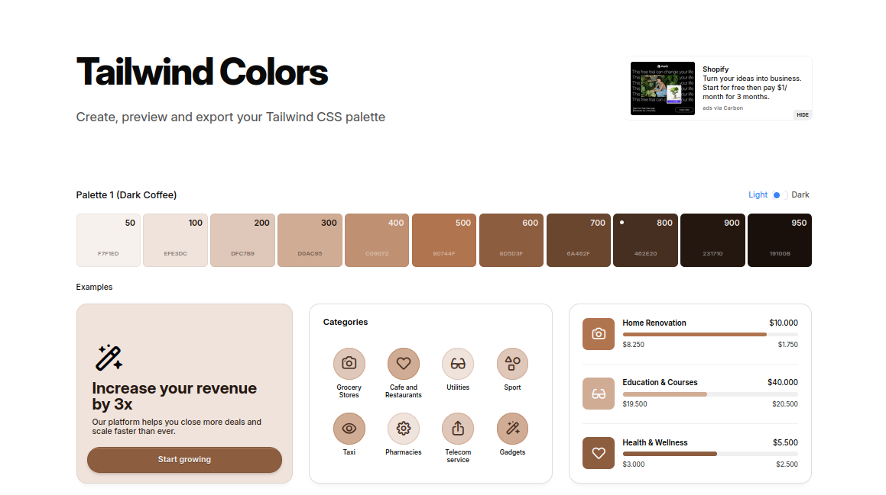
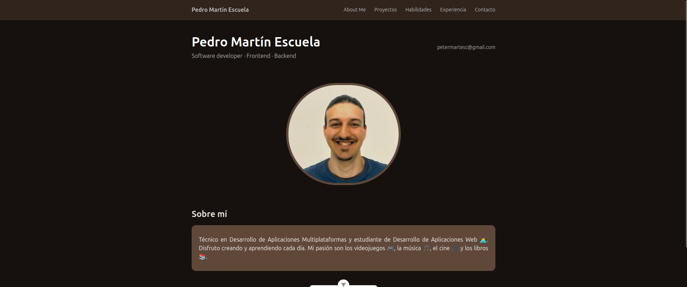
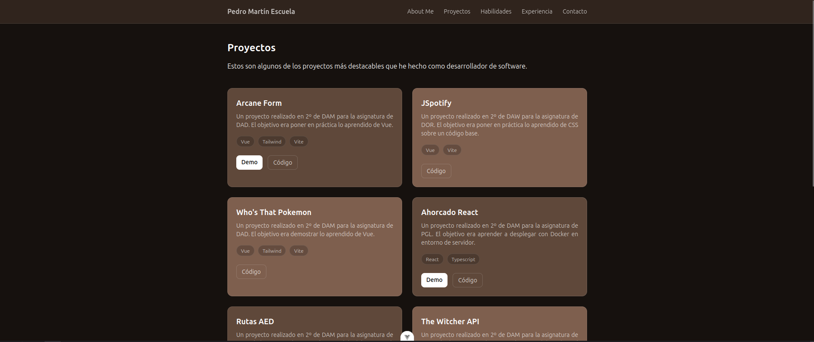
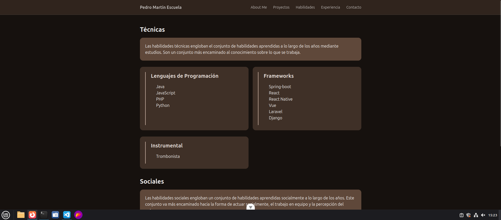
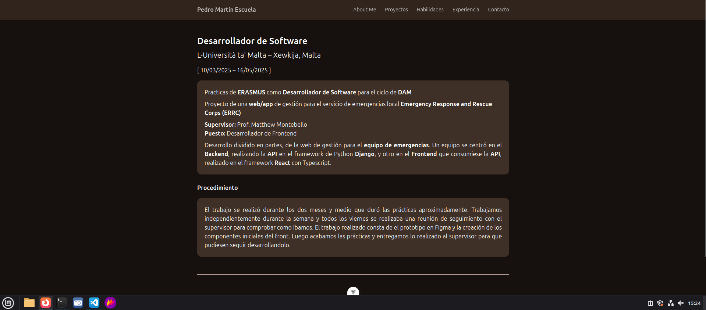
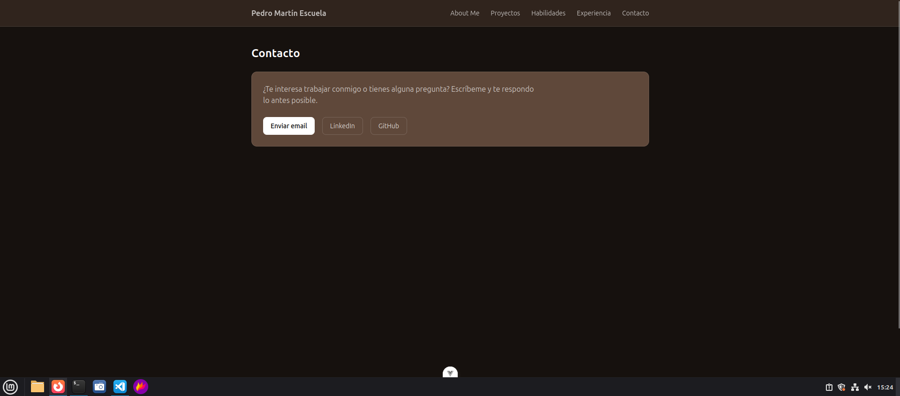

# Portafolio Personal

## Objetivo

EL objetivo de esta práctica es crear un portfolio personal para subir los proyectos realizados, la experiencia y demás información personal laboral.

## Diseño previo

Quería darle un toque oscuro al estilo de Silent Hill, pero era una decisión de diseño algo arriesgada. Finalmente, como me vi apurado, decidí darle un enfoque  más seguro con alguno de los colores de la paleta.

    

[Paleta de colores de Silent Hill](https://www.reddit.com/r/silenthill/comments/k9pl78/silent_hill_2_enhanced_edition_colors_chart/)

Utilicé esta página que te genera una paleta de colores a partir de un color, y te da ejemplos de componentes y como debe usarse la paleta

    

[Paleta re-generada con Coolors](https://coolors.co/tailwind/493021)

## Realización del código

Comencé a realizar el porfolio ruta por ruta. 

Primero hice la de About Me, que contiene una breve información sobre mi, mi foto, y un botón para descargar mi currículum.

    

Luego hice la ruta de Proyectos, que contiene algunos de mis trabajos realizados en los dos ciclos. El diseño de cada proyecto está implementado en un componente aparte que va cargando la información de forma dinámica segun se quiera.

    

Seguí por el apartado de habilidades, que decidí estructurar en dos bloques, técnicas y sociales. Luego las dividí en otras categorías, lenguajes, frameworks, musicales (debidos a mis estudios de música).

    

En la parte de Experiencia, expliqué el trabajo realizado de Erasmus el año pasado, mi función principal en el proyecto y el objetivo general de este. También anoté las herramientas empleadas y la información de la "empresa".

    

Y finalmente en el apartado de contacto, coloqué un sencillo bloque con varios botones para acceder a las urls de mis redes de sociales relacionadas con mi trabajo, y uno extra que permite mandar un correo a mi dirección.

    

## Conclusión

En definitiva, este trabajo me parece una opción muy productiva ya que se realiza tanto una actividad para clase como un proyecto que puede servir a futuro y crecer con el que lo realiza. Además, he aprendido y repasado varios contenidos de tailwind y vue, que nunca viene mal.